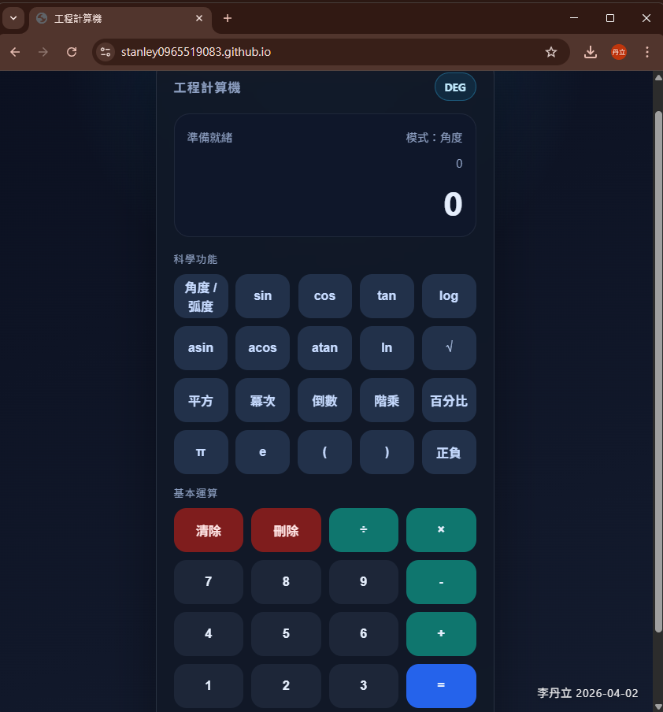

# 工程計算機

以 `HTML`、`CSS`、`JavaScript` 製作的前端工程計算機，可在瀏覽器中直接完成科學運算，包含三角函數、反三角函數、對數、平方根、階乘、次方、百分比與角度 / 弧度切換。整體介面以深色玻璃風格設計，兼顧操作清楚度與視覺完整性，適合作為前端互動作品與學習歷程展示。

## 專案特色

- 支援常見工程計算需求：`sin`、`cos`、`tan`、`asin`、`acos`、`atan`、`log`、`ln`、`√`、階乘、次方、倒數、百分比
- 可切換 `DEG` / `RAD` 模式，符合三角函數不同情境的使用需求
- 具備括號與運算優先順序處理，能輸入較完整的數學表達式
- 針對錯誤輸入提供提示，例如括號不匹配、定義域錯誤、除以零、非合法數字格式
- 響應式版面設計，可在桌機與手機瀏覽器中使用
- 單檔完成核心功能，方便部署、展示與說明

## 技術亮點

- 使用原生 `JavaScript` 實作，不依賴外部框架
- 自行撰寫運算式解析流程：
  - `tokenize` 將輸入拆成可處理的符號
  - `toRpn` 將中序表示式轉為逆波蘭表示法
  - `evaluateRpn` 依序計算結果
- 未直接使用 `eval()`，提高程式可控性與安全性
- 針對不同函數加入定義域檢查，讓結果更穩定可靠

## 學習歷程重點

這個作品展現的不只是畫面排版，而是我能把數學運算邏輯、介面設計與使用者操作流程整合成完整前端作品。從按鈕互動、模式切換，到運算式解析與錯誤處理，都是自行規劃與實作，能反映我在資訊、程式設計與問題拆解上的基礎能力。

## 使用方式

1. 開啟 GitHub Pages 頁面：<https://stanley0965519083.github.io/>
2. 或直接下載專案後開啟 `index.html`
3. 點擊按鈕輸入算式，按下 `=` 即可計算

## 專案檔案

- `index.html`：包含介面設計、按鈕配置、運算邏輯與互動功能

## 技術關鍵字

`HTML` `CSS` `JavaScript` `Responsive Design` `Scientific Calculator` `Expression Parser` `RPN`
